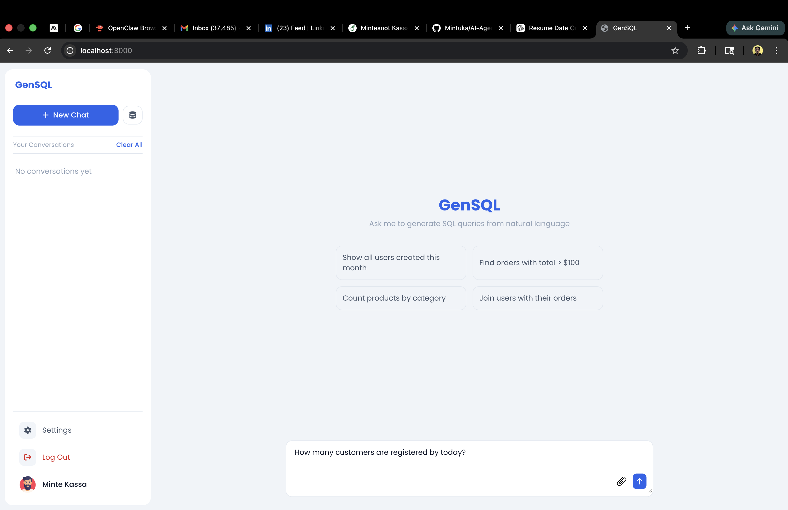

# AI-Agent-for-SQL-Query

## Overview

QueryGPT is an AI-powered application that provides intelligent responses to user queries by leveraging large language models. The application consists of a **Next.js frontend** and a **Python backend** service.

---

## Prerequisites

- Node.js (for development)
- Python 3.8+ (for development)

---

## Getting Started

### Running the Application Locally

**Clone the repository**

```bash
git clone https://github.com/your-repo/querygpt.git
cd querygpt
```

**Start the backend**

```bash
cd backend
pip install -r requirements.txt
flask run --host=0.0.0.0 --port=8080 --reload
```

**Start the frontend** (in a separate terminal)

```bash
cd frontend
npm install
npm run dev
```

The application will be available at:  
👉 `http://localhost:3000`

---

## Development Setup

### Frontend: Development Mode Watch Config

Edit `frontend/next.config.ts` and add the webpack watch options if needed for file watching in development:

```ts
webpack: (config) => {
  config.watchOptions = {
    poll: 1000,
    aggregateTimeout: 300,
  };
  return config;
},
```

---

## Project File Structure

```
querygpt/
├── frontend/              # Next.js application
│   ├── public/            # Static files
│   ├── src/               # Application source code
│   └── next.config.ts     # Next.js config
├── backend/               # Python backend service
│   ├── app/               # Application code
│   └── requirements.txt   # Python dependencies
└── README.md              # This file
```

---

## Environment Variables

### Frontend (`frontend/.env`)

```env
NEXT_PUBLIC_API_URL=YOUR_API_BASE_URL
```

### Backend (`backend/.env`)

```env
OPENAI_API_KEY=YOUR_OPENAI_KEY
DATABASE_URL=YOUR_MONGODB_URL
```

---
